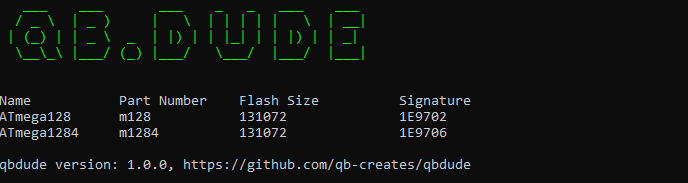
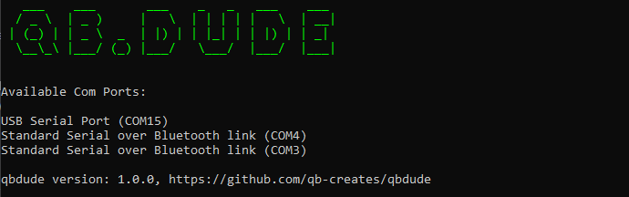
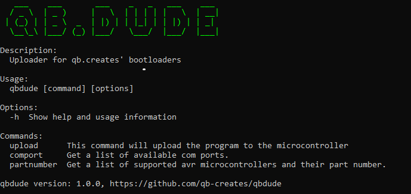

# QB.DUDE

QB.DUDE is a program for uploading program data to the on chip memories of Microship's <a href="https://en.wikipedia.org/wiki/AVR_microcontrollers">AVR microcontrollers.</a>. This utility will upload program data to AVR microcontrollers that are running a QB.Creates bootloader. Supported microcontrollers and QB.Creates bootloaders can be found <a href="https://github.com/qb-creates/avr-bootloaders">here</a>.

## Installing QB.DUDE
To install the QB.DUDE, unzip the provided zip file and ensure all its contents reside in the same directory. Place the extracted files in a location of your choice, ensuring it's somewhere easily accessible for future use. The QB.DUDE executable is now ready for use in its designated directory. The latest release for QB.DUDE can be found <a href="https://github.com/qb-creates/qbdude/releases">here</a>

## Using QB.DUDE 
QB.DUDE is a command line application. Run the ```qbdude``` executable in the command line with the '-h' option or without any options to get a list of commands and options. Run the ```qbdude``` executable in the command line with a valid command followed by -h option to give more information about that command.

### Upload
The following checks will be performed to make sure that the hex file can be uploaded to the microcontroller. If any of these checks fail, the upload process will fail.
- Will make sure the boot reset vector is set for supported microcontrollers.
- Will make sure that the microcontroller has enough flash space to hold all of the data in the HEX file.
- Will compare the signature of the actual device to the partnumber option that was passed in.
- Will send commands to the microcontroller and await for acknowledgements to make sure a QB.Creates bootloader is running on the microcontroller.
  

The command to upload a HEX file into your AVR microcontroller looks like this:
```
qbdude upload -p [PARTNUMBER] -C [COMPORT] -F [HEXFILEPATH]
```

<br> 

To upload program data to an ATmega128 microcontroller connected to COM5 with a HEX file called firmware.hex, you would run the following command:
```
qbdude upload -p m128 -C COM5 -F firmware.hex
```

<br> 

### Part Numbers
Supported partnumbers can be found in the microcontrollers.json file. Part numbers are the key for each object in the array. 
Alternatively, you can run the ```partnumber``` command to get all supported part numbers



Part number Example:
```
qbdude partnumber
```

<br> 

### Comports
Run the ```comport``` command without an options to view the available comports on your system. All comport names will be printed along with their description.



Comport example:
```
qbdude comport
```

<br> 

## Simplifying Execution
### Setting Environment Path (Windows 10)
Setting an environment path for QB.DUDE will make it accessible from any directory in the terminal without having to provide the full path to the executable. It simplifies the command line usage and allows you to run the executable directly by its name, regardless of the current working directory.

#### Steps to setup a path for QB.DUDE in the environment variables:

1. Open System Properties:
    - Open the Start menu.
    - Begin typing "View advanced system settings" (without quotes).
    - Select the "View advanced system settings" option.
2. Open Environment Variables:
    - In the System Properties window, click the "Environment Variables..." button.
3. Modify User or System Variables:
    - In the Environment Variables window, you'll see two sections: "User variables" and "System variables".
    - To set the path for the current user, add or modify the "Path" variable under "User variables".
    - To set the path for all users, add or modify the "Path" variable under "System variables".
4. Add or Edit Path Variable:
    - Select the "Path" variable and click "Edit..." (or "New..." to add a new one).
    - Click "Browse..." to find the directory containing the qbdude executable.
5. Apply Changes:
    - Click "OK" in each window to apply the changes.
6. Verify Path:
    - Open a new Command Prompt or PowerShell window.
    - Type qbdude. You should see the image below

      


### VS Code With PlatformIO extensions
If you're coding for AVR microcontrollers in VS Code with the PlatformIO extension, using a script to run QB.DUDE can simplify things. With a script in VS Code, you can easily upload programs without leaving the editor. QB.DUDE does its job right inside the integrated terminal, so you can handle your projects without switching around. When you create a script, a button appears in the NPM SCRIPTS toolbar with its name, allowing you to upload with just one click.

#### Steps to setup node and create a script:
1. Install node.js (if not already installed)
    - Visit the official Node.js website.
    - Download the latest LTS version of Node.js (includes npm).
    - Follow the installation instructions for your operating system.
2. Initialize package.json
   ```
   npm init
   ```
3. Add a Script to generated package.json file
   ```
    "scripts": {
      "qbdude-upload": "qbdude upload -p [PARTNUMBER] -C [COMPORT] -F [FILEPATH]"
    },
   ```
   - If the qbdude path is set in the environment variables you only need "qbdude" in the script. If it is not you will need to put the entire file path to the executable.
   - Replace [PARTNUMBER], [COMPORT], and [FILEPATH] with the actual values or placeholders you intend to use. 
4. Run the script
    - Open a terminal in VS Code ( ctrl + ` ).
    - Look for the "NPM SCRIPTS" toolbar at the bottom.
    - Click the button with the name of your qbdude script (e.g., "qbdude-upload"). If the button is not there, you may have to run "npm run qbdude-upload" in the terminal first.
  
### Micrchip Studio And External Tools
If you're in Microchip Studio, setting up QB.DUDE as an external tool is a useful approach to improve your workflow. Through the External Tools menu, you can easily trigger QB.DUDE uploads without the need to switch between applications.

#### Steps to setup external tools:
1. Open Microchip Studio.
2. Navigate to Tools > External Tools.
3. In the External Tools window, click on the Add button to create a new external tool.
4. Set the following parameters:
    - Title: Enter a descriptive title, such as "qbdude Upload."
    - Command: Provide the full path to the qbdude executable or the command needed to run it. For example, if qbdude is in your system's PATH, you can simply enter qbdude.
    - Arguments: Specify the arguments needed for the qbdude upload command.
        
        ```
        -p [PARTNUMBER] -C [COMPORT] -F [FILEPATH].
        ```
5. Uncheck the Use Output Window and Close on Exit options. QB.DUDE currently can not run in Microchip Studio's output window
6. Optionally, you can set up a keyboard shortcut under the Tools > Options > Environment > Keyboard menu to quickly access the external tool.
7. Click OK to save the external tool configuration.
