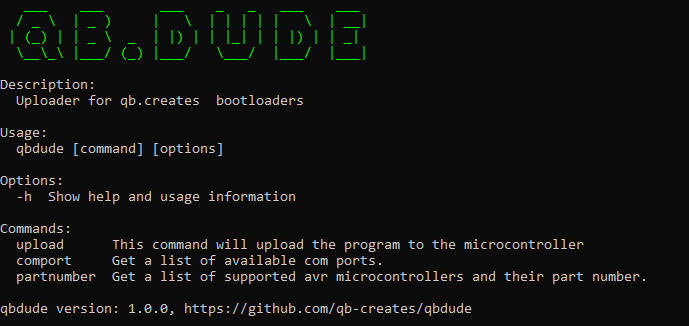

# QB.DUDE

QB.DUDE is a program for uploading program data to the on chip memories of Microship's <a href="https://en.wikipedia.org/wiki/AVR_microcontrollers">AVR microcontrollers.</a>. This utility will upload program data to AVR microcontrollers that are running a QB.Creates bootloader. Supported microcontrollers and QB.Creates bootloaders can be found <a href="https://github.com/qb-creates/avr-bootloaders">here</a>.

All QB.DUDE releases can be found here: https://github.com/qb-creates/qbdude/releases

## Setting Environment Path (Windows 10)
1. Open System Properties:
    - Open the Start menu.
    - Begin typing "View advanced system settings" (without quotes).
    - Select the "View advanced system settings" option.
2. Open Environment Variables:
    - In the System Properties window, click the "Environment Variables..." button.
3. Modify User or System Variables:
    - In the Environment Variables window, you'll see two sections: "User variables" and "System variables".
    - To set the path for the current user, add or modify the "Path" variable under "User variables".
    - To set the path for all users, add or modify the "Path" variable under "System variables".
4. Add or Edit Path Variable:
    - Select the "Path" variable and click "Edit..." (or "New..." to add a new one).
    - Click "Browse..." to find the directory containing the qbdude executable.
5. Apply Changes:
    - Click "OK" in each window to apply the changes.
6. Verify Path:
    - Open a new Command Prompt or PowerShell window.
    - Type qbdude. You should see the image below

      


## Using QB.DUDE 
QB.DUDE is a command line application. Run the ```qbdude``` executable in the command line with the '-h' option or without any options to get a list of commands and options. Run the ```qbdude``` executable in the command line with a valid command followed by -h option to give more information about that command.

### Upload
The following checks will be performed to make sure that the hex file can be uploaded to the microcontroller. If any of these checks fail, the upload process will fail.
- Will make sure the boot reset vector is set for supported microcontrollers.
- Will make sure that the microcontroller has enough flash space to hold all of the data in the HEX file.
- Will compare the signature of the actual device to the partnumber option that was passed in.
- Will send commands to the microcontroller and await for acknowledgements to make sure a QB.Creates bootloader is running on the microcontroller.
  

The command to upload a HEX file into your AVR microcontroller looks like this:
```
qbdude upload -p [PARTNUMBER] -C [COMPORT] -F [HEXFILEPATH]
```

<br> 

To upload program data to an ATmega128 microcontroller connected to COM5 with a HEX file called firmware.hex, you would run the following command:
```
qbdude upload -p m128 -C COM5 -F firmware.hex
```

<br> 

### Part Numbers
Supported partnumbers can be found in the microcontrollers.json file. Part numbers are the key for each object in the array. 
Alternatively, you can run the following command to get all supported part numbers


Part number Example:
```
qbdude partnumber
```

<br> 

### Comports
Run the ```comport``` command without an options to view the available comports on your system. All comport names will be printed along with their description.


Comport example:
```
qbdude comport
```
